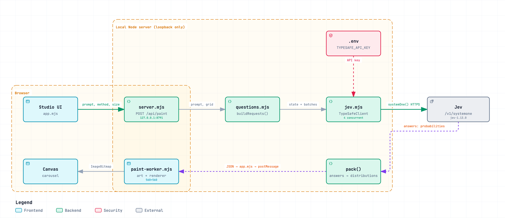

# jev-sunday

A collection of small, self-contained experiments built on [Jev](https://typesafe.ai)
by TypeSafe. Each folder is one use case: independent, runnable on its own, with
its own README and screenshots.

Jev never generates text or images. It answers small typed questions with a
probability distribution. These experiments explore what you can build when the
model's uncertainty is the raw material.

## Experiments

| Project | What it does | Run |
| --- | --- | --- |
| [jev-van-gogh](./jev-van-gogh) | Turns per-pixel colour distributions into oil paintings. Confident pixels become smooth colour, uncertain pixels become thick visible brushwork. | `cd jev-van-gogh && npm install && npm start` |



## Layout

```
jev-sunday/
  jev-<name>/        one experiment per folder
    README.md        what it does and how to run it
    .env.example     required keys, copy to .env
    docs/            diagrams and screenshots
```

Each experiment keeps its own `package.json`, `.gitignore`, and `.env`. Nothing is
shared between folders.

## Requirements

- Node 20+
- A TypeSafe API key in each experiment's `.env`
