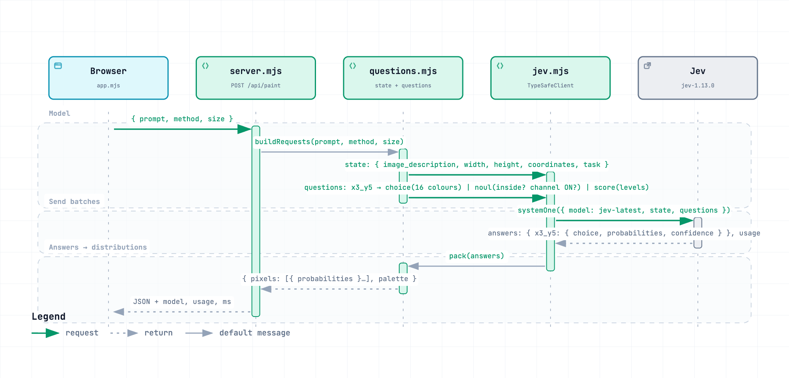

# jev-van-gogh

A local studio that turns Jev's per-pixel probability distributions into oil
paintings.

Jev never generates an image. It only answers small typed questions such as
"what colour is pixel (x=3, y=5)?" with a probability distribution. The
renderer then paints those distributions: confident pixels become smooth
colour, uncertain pixels become thick, visible, mixed brushwork.

## Run

Requires Node 20+ and a modern browser (module workers + OffscreenCanvas).

```sh
npm install
cp .env.example .env               # then paste your TypeSafe API key into .env
npm start                          # http://127.0.0.1:8791
```

The key is read from `TYPESAFE_API_KEY`. `npm start` loads `.env` automatically;
exporting the variable in your shell works too. `.env` is git-ignored.

Open the page, pick a representation and grid size in Settings, type a prompt,
press Paint. Each painting joins a carousel. Settings also shows the model,
request count, input tokens, and timings for the selected painting.

## How it fits together


Open the interactive version at [`docs/system-architecture.html`](docs/system-architecture.html)
for guided views, search, and focus. The request modelling (state object, per-pixel
questions, batches, answers) has its own diagram:



Interactive: [`docs/jev-request-sequence.html`](docs/jev-request-sequence.html).
Both are generated from the JSON specs in `docs/` with Archify; `npm run diagrams`
re-exports the PNGs from the delivered HTML.

## How Jev is used

Everything about Jev lives in two files.

### `src/questions.mjs`: prompt → typed questions

The **state** is shared by every question in a request: the prompt, the canvas
size, the coordinate convention, and a one-line composition task.

```js
{
  image_description: "A sunflower on a pale blue background",
  width: 12, height: 12,
  coordinates: "Origin (0,0) is the top-left pixel. x increases right, y increases down.",
  task: "Compose one coherent, recognizable pixel-art image ... No text, no border."
}
```

Each pixel becomes one or more **questions**. The primitive is chosen by what
the answer means:

| Representation | Per pixel | Primitive                                             | Why                                 |
| -------------- | --------- | ----------------------------------------------------- | ----------------------------------- |
| Palette        | 1         | `choice` over 16 named colours                        | One option from a fixed set         |
| Silhouette     | 1         | `noul` "inside the subject?"                          | A yes/no condition                  |
| Binary RGB     | 3         | `noul` per channel "is red ON?"                       | Three independent conditions        |
| HSL            | 3         | `choice` hue + `score` saturation + `score` lightness | A category plus two ordered degrees |

Question IDs (`x3_y5`, `x3_y5_hue`) are for our code only. Jev never sees
them, so the coordinates are repeated inside the instructions text.

A 24×24 palette grid is 576 questions. They are split into batches of 144 and
each batch carries the same state, so every request still sees the whole
composition. Jev evaluates all questions in a request in parallel against that
state, which is why hundreds of tiny questions per request is the natural shape.

`pack()` reads the answers back. It keeps the **full distribution**
(`probabilities` for Choice/Score, `noul` for Noul), never just the top choice.
That distribution is the painting's raw material.

### `src/jev.mjs`: running the batches

```js
const client = new TypeSafeClient(); // reads TYPESAFE_API_KEY
const result = await client.systemOne({
  state,
  questions,
  model: 'jev-latest',
});
```

Four batches run concurrently. Batches are independent and cannot see each
other's answers, which is fine here: every pixel is judged only against the
shared state. The SDK handles retries and rate-limit backoff.

The SDK refuses to run in a browser because it would expose the key. That is
why `server.mjs` exists: the browser posts `{ prompt, method, size }` to
`/api/paint`, the server asks Jev, and the key never leaves the process.
(jev-paint solved the same problem with a Python proxy and a key pasted into
the page.)

## How the painting is made

`web/art.mjs` expands each pixel's answers into a categorical distribution over
concrete RGB colours. Palette and silhouette are already categorical. RGB and
HSL come from several independent questions, so their joint distribution is the
product of the per-question probabilities. Each pixel then gets a **mean
colour** (the probability-weighted average) and its **entropy**.

`web/renderer.mjs` paints in four passes, all deterministic:

1. **Underpainting.** The mean colour, bilinearly interpolated to 560×560. Where
   Jev is confident this is almost the final image.
2. **Sampling.** Stroke colours are drawn from the distribution, not the mean.
   One smooth Gaussian noise field per pigment feeds a Gumbel-max sample, so
   neighbouring strokes tend to agree and colour patches form.
3. **Strokes.** 2,300 candidate strokes. A stroke is only kept with probability
   proportional to local entropy, so confident regions stay smooth and uncertain
   regions get dense impasto. Strokes follow iso-luminance contours of the
   underpainting and stop at strong edges. Each stroke deposits colour and
   height; same-colour passes merge, different colours stack.
4. **Lighting.** The height map is blurred (colours stay sharp) and lit from
   the upper-left with diffuse, specular, and short cast shadows.

Rendering runs in a module worker (`web/paint-worker.mjs`) so the page stays
responsive, and the finished canvas fades in.

## Checks

```sh
npm test                                     # question shapes, packing, renderer
node scripts/preview.mjs tests/fixtures/palette.json   # renders out/palette.png offline
npm run diagrams                             # re-exports docs/*.png (needs Google Chrome)
```

`tests/fixtures/palette.json` is a recorded 12×12 Jev palette response taken
from jev-paint (MIT). Tests and previews run offline and cost no tokens.

## Cost and limits

Jev bills per input token. Every batch resends the state, so the token count
grows with grid size and with the number of questions per pixel (HSL and RGB
are three times the palette count). The Settings panel shows the input tokens
for each painting so you can see what a size costs before going bigger.

## Files

- `server.mjs`: static files + `POST /api/paint`
- `src/questions.mjs`: state, per-pixel questions, batching, answer packing
- `src/jev.mjs`: SDK client and concurrent batch runner
- `web/art.mjs`: distributions → colours, means, entropy inputs
- `web/renderer.mjs`: painting algorithm
- `web/paint-worker.mjs`, `web/app.mjs`, `web/index.html`, `web/style.css`: UI

## License

MIT
